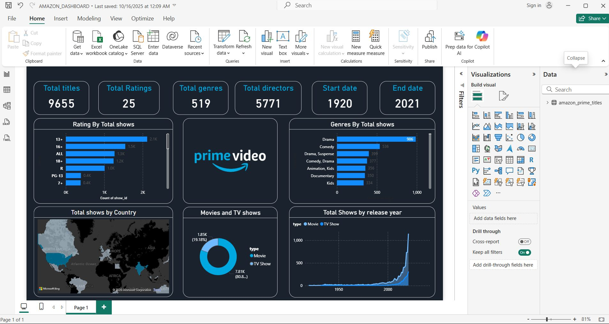

# Amazon Prime Show Ratings Dashboard – Power BI Project

## 📌 Overview
This Power BI dashboard analyzes Amazon Prime shows based on:
- Ratings
- Type (Movies vs TV Shows)
- Genres
- Country-wise distribution
- Release year trends

## 🎯 Objective
To analyze and visualize Amazon Prime show performance using Power BI and identify trends,
popular content types, and top-performing regions.

## 🧰 Tools Used
- Power BI
- Power Query
- Data Cleaning
- Data Visualization

## 💡 Key Insights
- Most shows released after 2015 (content growth trend)
- Movies dominate over TV Shows in count
- USA and India lead in content production
- Ratings mostly between 3 and 5 stars

## 📸 Dashboard Preview

## 📁 Files Included
- AMAZON_DASHBOARD.pbix
- Amazon prime project_PPT.pptx
- dashboard.jpeg
